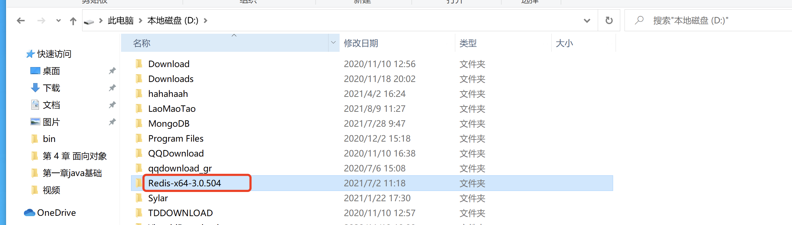
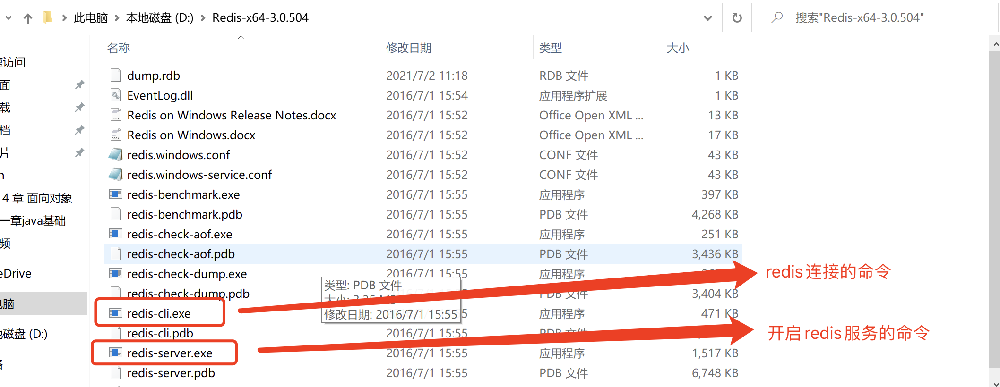
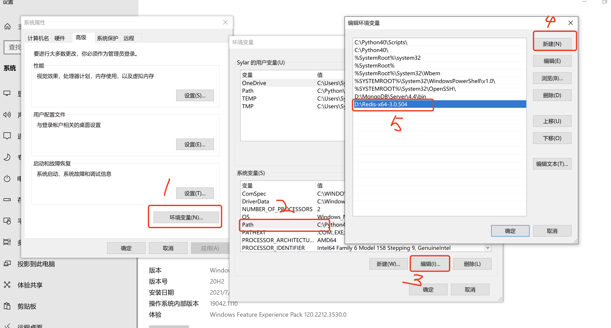
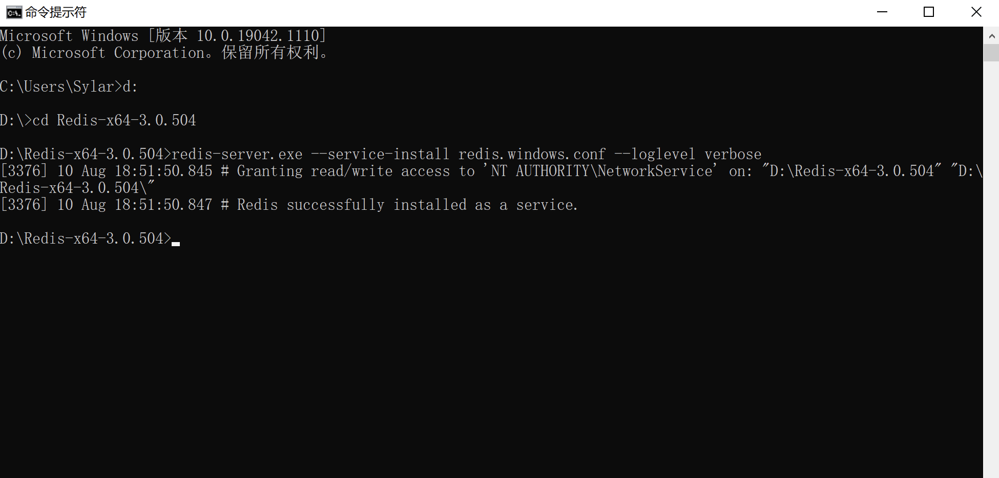
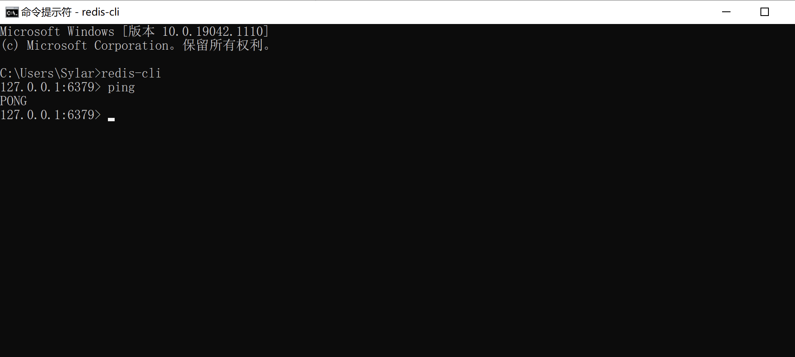
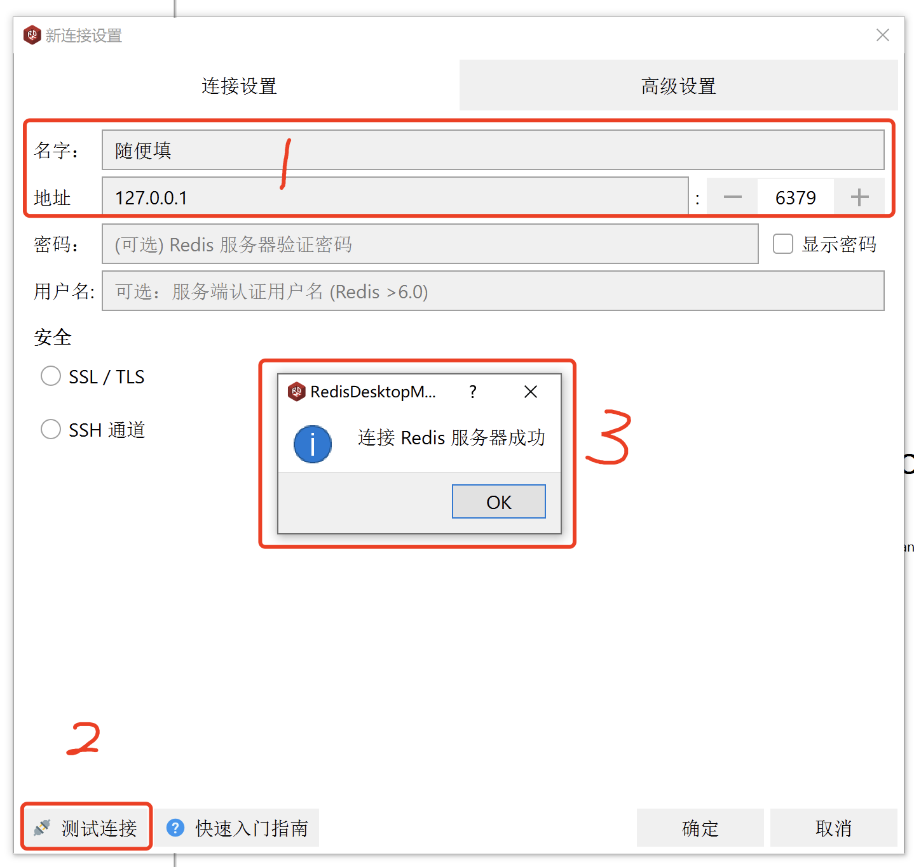

# Scrapy抓取全网站数据

## 一. 使用常规Spider

我们把目光对准汽车之家. 抓取二手车信息.

注意, 汽车之家的访问频率要控制一下. 要不然会跳验证的. 

```python
DOWNLOAD_DELAY = 3
```

```python
class ErshouSpider(scrapy.Spider):
    name = 'ershou'
    allowed_domains = ['che168.com']
    start_urls = ['https://www.che168.com/beijing/a0_0msdgscncgpi1ltocsp100exx0/?pvareaid=102179#currengpostion']

    def parse(self, resp, **kwargs):
        # print(resp.text)
        # 链接提取器
        le = LinkExtractor(restrict_xpaths=("//ul[@class='viewlist_ul']/li/a",), deny_domains=("topicm.che168.com",) )
        links = le.extract_links(resp)
        for link in links:
            yield scrapy.Request(
                url=link.url,
                callback=self.parse_detail
            )
        # 翻页功能
        le2 = LinkExtractor(restrict_xpaths=("//div[@id='listpagination']/a",))
        pages = le2.extract_links(resp)
        for page in pages:
            yield scrapy.Request(url=page.url, callback=self.parse_detail)

    def parse_detail(self, resp, **kwargs):
        title = resp.xpath('/html/body/div[5]/div[2]/h3/text()').extract_first()
        print(title)

```

LinkExtractor: 链接提取器. 可以非常方便的帮助我们从一个响应页面中提取到url链接. 我们只需要提前定义好规则即可. 

参数: 

​	allow, 接收一堆正则表达式, 可以提取出符合该正则的链接
​	deny, 接收一堆正则表达式, 可以剔除符合该正则的链接
​	allow_domains: 接收一堆域名, 符合里面的域名的链接被提取
​	deny_domains: 接收一堆域名, 剔除不符合该域名的链接
​	restrict_xpaths: 接收一堆xpath, 可以提取符合要求xpath的链接
​	restrict_css: 接收一堆css选择器, 可以提取符合要求的css选择器的链接
​	tags: 接收一堆标签名, 从某个标签中提取链接, 默认a, area
​	attrs: 接收一堆属性名, 从某个属性中提取链接, 默认href

值得注意的, ==在提取到的url中, 是有重复的内容的. 但是我们不用管. scrapy会自动帮我们过滤掉重复的url请求.== 


## 二. 使用CrawlSpider

在scrapy中提供了CrawlSpider来完成全站数据抓取. 

1. 创建项目

    `scrapy startproject qichezhijia`

2. 进入项目

    `cd qichezhijia`

3. 创建爬虫(CrawlSpider)

    `scrapy genspider `==-t crawl==` ershouche che168.com`

    和以往的爬虫不同. 该爬虫需要用到crawl的模板来创建爬虫. 

4. 修改spider中的rules和回调函数

    ```python
    class ErshoucheSpider(CrawlSpider):
        name = 'ershouche'
        allowed_domains = ['che168.com', 'autohome.com.cn']
        start_urls = ['https://www.che168.com/beijing/a0_0msdgscncgpi1ltocsp1exx0/']
    
        le = LinkExtractor(restrict_xpaths=("//ul[@class='viewlist_ul']/li/a",), deny_domains=("topicm.che168.com",) )
        le1 = LinkExtractor(restrict_xpaths=("//div[@id='listpagination']/a",))
        rules = (
            Rule(le1, follow=True),  # 单纯为了做分页
            Rule(le, callback='parse_item', follow=False), # 单纯提取数据
        )
    
        def parse_item(self, response):
            print(response.url)
    ```

    CrawlSpider的工作流程. 

    前期和普通的spider是一致的. 在第一次请求回来之后. 会自动的将返回的response按照rules中订制的规则来提取链接. 并进一步执行callback中的回调. 如果follow是True, 则继续在响应的内容中继续使用该规则提取链接.  相当于在parse中的scrapy.request(xxx, callback=self.parse)

    

## 三. Redis简单使用

​		redis作为一款目前这个星球上性能最高的非关系型数据库之一. 拥有每秒近十万次的读写能力. 其实力只能用恐怖来形容. 

  1. 安装redis

     redis是我见过这个星球上最好安装的软件了. 比起前面的那一坨. 它简直了...

     直接把压缩包解压. 然后配置一下环境变量就可以了. 

     

     

     接下来, 在环境变量中将该文件夹配置到path中. 

     

     win7的同学自求多福吧...

     

     我们给redis多配置几个东西(修改redis的配置文件, mac是: redis.conf, windows是: )

       1. 关闭bind

          ```python
          # bind 127.0.0.1 ::1  # 注释掉它
          ```

       2. 关闭保护模式  windows不用设置

          ```python
          protected-mode no    # 设置为no
          ```

       3. 设置密码

          ```python
          requirepass 123456   # 设置密码
          ```

          

     将redis怼到windows服务==必须进入到redis目录后才可以==

     

     ```cmd
     # 将redis安装到windows服务
     redis-server.exe --service-install redis.windows.conf --loglevel verbose
     # 卸载服务：
     redis-server --service-uninstall
     # 开启服务：
     redis-server --service-start
     # 停止服务：
     redis-server --service-stop
     ```

     

     使用redis-cli链接redis

     ```python
     redis-cli -h ip地址 -p 端口 --raw   # raw可以让redis显示出中文
     auth 密码   # 如果有密码可以这样来登录, 如果没有.不用这一步
     ```

     

     附赠RDM, redis desktop manager. 可以帮我们完成redis数据库的可视化操作(需要就装, 不需要就算)

     

     

  2. redis常见数据类型

     redis中常见的数据类型有5个. 

     命令规则:  `命令 key 参数`

     1. string

         字符串(它自己认为是字符串, 我认为是任何东西. ), redis最基础的数据类型. 

         常用命令

         ```python
         set key value  # 添加一条数据
         get key		   # 查看一条数据
         incr key       # 让该key对应的数据自增1(原子性, 安全)
         incrby key count     # 让该key对应的value自增 count 
         type key		# 查看数据类型(set进去的东西一律全是字符串)
         ```

         例如

         ```python
         set name zhangsan  # 添加数据  name = zhangsan
         get name		# 查看数据 zhangsan
         
         set age 10
         get age 	# 10
         incr age	# 11
         get age 	# 11
         incrby age 5	# 16
         ```

         

     2. hash

         哈希, 相当于字典. 

         常见操作

         ```python
         hset key k1 v1   # 将k1, v1存储在key上
         hget key k1      # 将key上的k1提取出来
         hmset key k1 v1 k2 v2 k3 v3....  # 一次性将多个k,v存储在key
         hmget key k1 k2....# 一次性将key中的k1, k2...提取出来
         hgetall key 	# 一次性将key中所有内容全部提取
         hkeys key		# 将key中所有的k全部提取
         hvals key 		# 将key中所有的v全部提取
         ```

         示例:

         ```python
         HMSET stu id 1 name sylar age 18
         HMGET stu name age   # syalr 18
         HGETALL stu		    # id 1 name sylar age 18
         HKEYS stu 	# id name age
         HVALS stu   # 1 syalr 18
         ```

         

     3. list

         列表, 底层是一个双向链表. 可以从左边和右边进行插入. 记住每次插入都要记得这货是个==双向链表==

         常见操作

         ```python
         LPUSH key 数据1 数据2 数据3.... # 从左边插入数据
         RPUSH key 数据1 数据2 数据3.... # 从右边插入数据
         LRANGE key start stop     # 从start到stop提取数据. 
         
         LLEN key	# 返回key对应列表的长度
         LPOP key        # 从左边删除一个.并返回被删除元素
         RPOP key		# 从右边删除一个.并返回被删除元素
         ```

         示例:

         ```python
         LPUSH banji yiban erban sanban siban
         LRANGE banji 0 -1   # yiban erban sanban siban
         RPUSH ban ban1 ban2 ban3
         LRANGE ban 0 -1     # ban1 ban2 ban3
         LPOP ban  # ban1
         LLEN key  # 2
         ```

         

     4. set

         set是无序的超大集合. 无序, 不重复. 

         常见操作

         ```python
         SADD key 值   # 向集合内存入数据
         SMEMBERS key  # 查看集合内所有元素
         SCARD key # 查看key中元素的个数
         SISMEMBER key val  # 查看key中是否包含val
         SUNION key1 key2  # 并集
         SDIFF key1 key2  # 差集合, 在key1中, 但不在key2中的数据
         SINTER key1 key2 # 计算交集, 在key1和key2中都出现了的
         SPOP key  # 随机从key中删除一个数据
         SRANDMEMBER key count # 随机从key中查询count个数据
         ```

         实例:

         ```python
         SADD stars 柯震东 吴亦凡 张默 房祖名   # 4
         SADD stars 吴亦凡    # 0. 重复的数据是存储不进去的.
         SMEMBERS stars   # 柯震东 吴亦凡 张默 房祖名
         SISMEMBER stars 吴亦凡  # 吴亦凡在 stars里么?  1 在  0 不在
         
         SADD my 周杰伦 吴亦凡 房祖名  
         SINTER stars my  # 计算交集  吴亦凡 房祖名
         
         SPOP my  # 随机删除一个
         SRANDMEMEBER my 2   # 从集合总随机查看2个
         
         ```

         

     5. zset

         有序集合, 有序集合中的内容也是不可以重复的. 并且存储的数据也是redis最基础的string数据. 但是在存储数据的同时还增加了一个score. 表示分值. redis就是通过这个score作为排序的规则的. 

         常用操作

         ```python
         ZADD key s1 m1 s2 m2 ... # 向key中存入 m1 m2 分数分别为s1 s2
         ZRANGE key start stop [withscores]   # 查看从start 到stop中的所有数据 [是否要分数]
         ZREVRANGE key start stop # 倒叙查看start到stop的数据
         ZCARD key   # 查看zset的数据个数
         ZCOUNT key min max  # 查看分数在min和max之间的数据量
         ZINCRBY key score member  # 将key中member的分值score
         ZSCORE key m  # 查看key中m的分值
         
         ```

         示例:

         ```python
         ZADD fam 1 sylar 2 alex 3 tory  # 添加三个数据
         ZRANGE fam 0 -1 WITHSCORES # 正序查看
         ZREVRANGE fam 0 -1 WITHSCORES   # 倒叙查看
         ZINCRBY fam 10 alex  # 给alex加10分
         ZADD fam 100 alex   # 给alex修改分数为100分
         ZSCORE fam alex   # 查看alex的分数
         ZCARD fam    # 查看fam的数据个数
         ```

     redis还有非常非常多的操作. 我们就不一一列举了. 各位可以在网络上找到非常多的资料. 

     ==各位大佬们注意. 数据保存完一定要save一下, 避免数据没有写入硬盘而产生的数据丢失==

## 四. python搞定redis

​	python处理redis使用专用的redis模块. 同样的, 它也是一个第三方库.

```cmd
pip install redis
```

​	获取连接(1)

```python
from redis import Redis

red = Redis(host="127.0.0.1",  # 地址
            port=6379,   # 端口
            db=0,   # 数据库
            password=123456,  # 密码
            decode_responses=True)  # 是否自动解码
```

​	获取连接(2)

```python
pool = redis.ConnectionPool(
        host="127.0.0.1",  # 地址
        port=6379,   # 端口
        db=0,   # 数据库
        password=123456,  # 密码
        decode_responses=True
)

r = redis.Redis(connection_pool=pool)
print(r.keys())
```


​	我们以一个免费代理IP池能用到的操作来尝试一下redis

```python
# 存入数据
red.set("sylar", "邱彦涛")
# 获取数据
print(red.get("sylar"))

lst = ["张三丰", "张无忌", "张翠山", "张娜拉"]
red.lpush("names", *lst)  # 将所有的名字都存入names

# # 查询所有数据
result = red.lrange("names", 0, -1)
print(result)

# 从上面的操作上可以看出. python中的redis和redis-cli中的操作是几乎一样的

# 接下来, 咱们站在一个代理IP池的角度来分析各个功能
# 抓取到了IP. 保存入库
red.zadd("proxy", {"192.168.1.1": 10, "192.168.1.2": 10})
red.zadd("proxy", {"192.168.1.3": 10, "192.168.1.6": 10})
red.zadd("proxy", {"192.168.1.4": 10, "192.168.1.7": 10})
red.zadd("proxy", {"192.168.1.5": 10, "192.168.1.8": 10})

# 给某一个ip增加到100分
red.zadd("proxy", {"192.168.1.4": 100})

# 给"192.168.1.4" 扣10分
red.zincrby("proxy", -10, "192.168.1.4")

# 分扣没了. 删除掉它
red.zrem("proxy", "192.168.1.4")

# 可用的代理数量
c = red.zcard("proxy")
print(c)
# 根据分值进行查询(0~100)之间
r = red.zrangebyscore("proxy", 0, 100)
print(r)

# 查询前100个数据(分页查询)
r = red.zrevrange('proxy', 0, 100)

# 判断proxy是否存在, 如果是None就是不存在
r = red.zscore("proxy", "192.168.1.4")
print(r)

```

